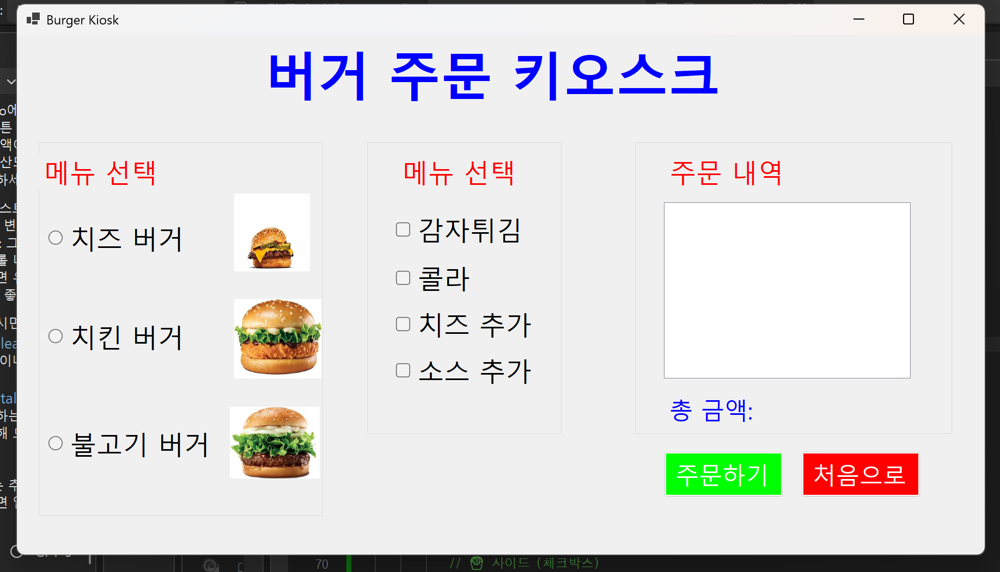
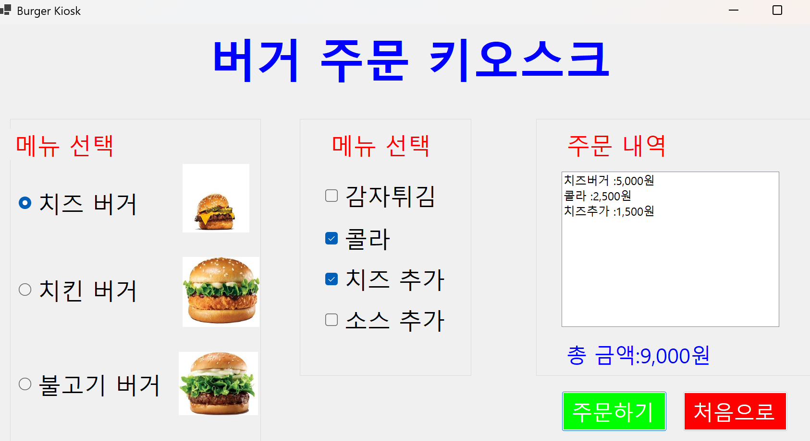
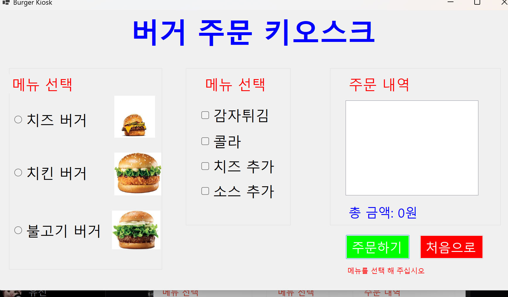

# (C# 코딩) 버거 키오스크
## 개요
- C# 프로그래밍 학습
- 1줄 소개: 
- 사용한 플랫폼:
- C#, .NET Windows Forms, Visual Studio, GitHub
- 사용한 컨트롤:
- Label, TextBox, ListBox, Button
- 사용한 기술과 구현한 기능:

## 실행 화면
- 코드의 실행 스크린샷과 구현 내용 설명

- 구현한 내용 (위 그림 참조)
	- RadioButton과 CheckBox 등을 적절히 배치하고  GroupBox로 적절하게 그룹어서 기본적인 UI를 구성
- 주문 내역과 총 금액을 List박스에 표시하도록 구현하였다.
- 초기화 버튼을 만들어 사용자가 다시 주문할 수 있도록 하였다.
- Tostring("N0")를 이용하여 가격의 가독성을 높혔다.
- 아무것도 선택하지 않았을 시 에러 메세지가 뜨도록 하였다.
