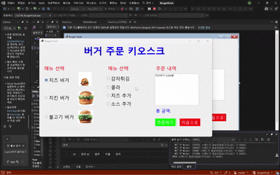
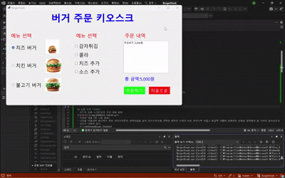

# (C# 코딩) 버거 키오스크
## 개요
- C# 프로그래밍 학습
- 1줄 소개: 사용자의 메뉴 선택에 따라 주문 내역과 총 금액을 보여주는 키오스크 프로그램
- 사용한 플랫폼:
- C#, .NET Windows Forms, Visual Studio, GitHub
- 사용한 컨트롤:
- Label, ListBox, Button, GroupBox, RadioButton, CheckBox
- 사용한 기술과 구현한 기능:
- RadioButton과 CheckBox를 이용하여 메뉴 선택 기능 구현
- ListBox와 Label을 이용하여 주문 내역과 총 금액 표시
- Button을 이용하여 주문 초기화 기능 구현
- 입력 검증을 통해 사용자가 메뉴를 선택하지 않았을 때 에러 메시지 표시
- Tab키로 그룹 이동이 가능하도록 설정하여 접근성 향상
- Enter키로 주문이 가능하도록 설정하여 사용자 편의성 향상
- 실시간으로 선택된 항목들의 가격이 리스트박스와 총 금액 라벨에 반영되도록 구현

## 실행 화면 (과제1)
- 코드의 실행 스크린샷과 구현 내용 설명

- 구현한 내용 (위 그림 참조)
	- RadioButton과 CheckBox 등을 적절히 배치하고  GroupBox로 적절하게 그룹어서 기본적인 UI를 구성
	- 주문 내역과 총 금액을 List박스에 표시하도록 구현하였다.
- 초기화 버튼을 만들어 사용자가 다시 주문할 수 있도록 하였다.
- Tostring("N0")를 이용하여 가격의 가독성을 높혔다.

## 실행 화면 (과제2)
- 코드의 실행 스크린샷과 구현 내용 설명

- 구현한 내용 (위 그림 참조)
- 아무것도 선택하지 않았을 시 에러 메세지가 뜨도록 하였다.

## 실행 화면 (과제3)
- 코드의 실행 스크린샷과 구현 내용 설명

- 구현한 내용 (위 그림 참조)
- 그룹박스의 속성에서 tapindex값과 tapstop값을 설정하여 Tab키로 그룹 이동이 가능하도록 하였다.
- 폼 속성창에서 AcceptButton = btnOrder으로 설정하여 Enter키로 주문이 가능하도록 하였다.

## 실행 화면 (과제4)
- 코드의 실행 스크린샷과 구현 내용 설명

- 구현한 내용 (위 그림 참조)
- if문을 이용하여 체크박스 혹은 라디오버튼이 선택되었을 경우 리스트박스에 선택한 항목의 가격이 바로 보이도록 하였고 총금액 라벨에 현재까지 선태된 항목들의 총 가격이 실시간으로 반영되도록 구현하였다.
- 코드는 다음과 같다.
- if (rdoCheeseBurger.Checked)
            {

                lstTotalCost.Items.Add("치즈버거 :" + 5000.ToString("N0") + "원");
                totalCost += 5000;
                lblTotalCost.Text = "총 금액:" + totalCost.ToString("N0") + "원";
            }
            else if (rdoChikenBurger.Checked)
            {
                lstTotalCost.Items.Add("치킨버거 :" + 4000.ToString("N0") + "원");
                totalCost += 4000;
                lblTotalCost.Text = "총 금액:" + totalCost.ToString("N0") + "원";
            }
            else if (rdoBulgogiburger.Checked)
            {
                lstTotalCost.Items.Add("불고기버거 :" + 3000.ToString("N0") + "원");
                totalCost += 3000;
                lblTotalCost.Text = "총 금액:" + totalCost.ToString("N0") + "원";
            }

            if (ckSide1.Checked)
            {

                lstTotalCost.Items.Add("감자튀김 :" + 3500.ToString("N0") + "원");
                totalCost += 3500;
                lblTotalCost.Text = "총 금액:" + totalCost.ToString("N0") + "원";

            }
            if (ckSide2.Checked)
            {
                lstTotalCost.Items.Add("콜라 :" + 2500.ToString("N0") + "원");
                totalCost += 2500;
                lblTotalCost.Text = "총 금액:" + totalCost.ToString("N0") + "원";
            }
            if (ckSide3.Checked)
            {
                lstTotalCost.Items.Add("치즈추가 :" + 1500.ToString("N0") + "원");
                totalCost += 1500;
                lblTotalCost.Text = "총 금액:" + totalCost.ToString("N0") + "원";
            }
            if (ckSide4.Checked)
            {
                lstTotalCost.Items.Add("소스추가 :" + 500.ToString("N0") + "원");
                totalCost += 500;
                lblTotalCost.Text = "총 금액:" + totalCost.ToString("N0") + "원";
            }